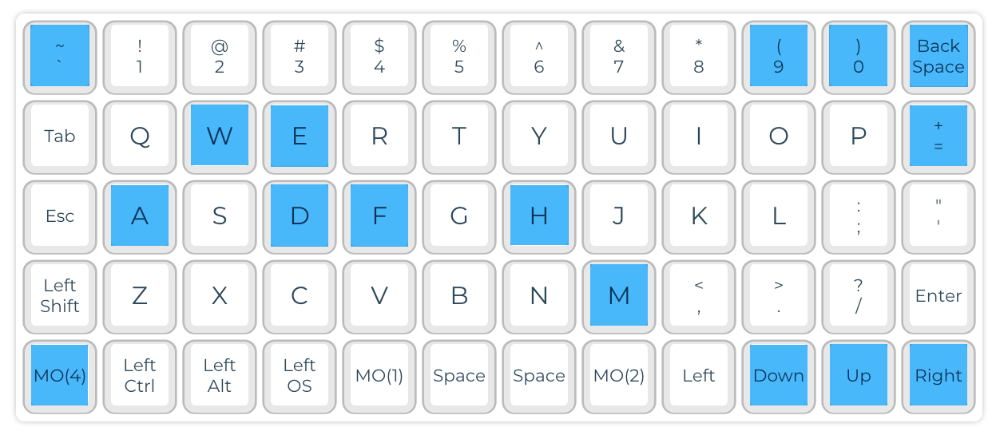
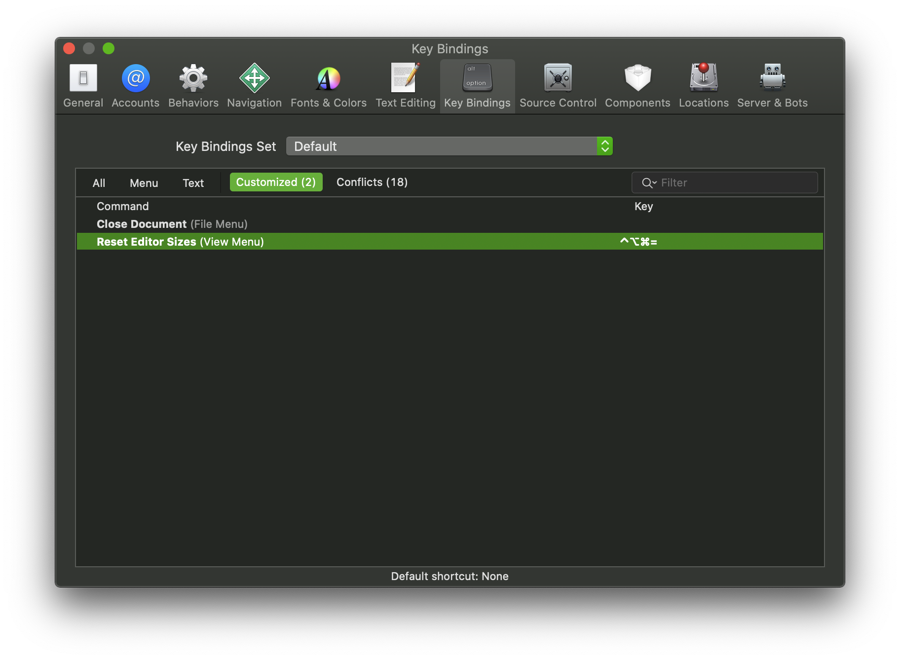

# mk
Custom Keymaps for Mechanical Keyboards (QMK)

## Preonic Xcode

**File**: `preonic_rev3_preonic_ver4.json`

* **`** Show/Hide Navigator
* **Backspace** Show/Hide Inspector
* **W** Close Editor
* **E** Edit in Scope
* **=** Reset Editor Sizes (Requires Key Binding. See below)
* **A** Show/Hide Authors
* **D** Add Documentation
* **F** Focus this Editor
* **H** Find Call Hierarchy
* **M** Show/Hide Minimap
* **Down** Decrease Font Size
* **Up** Increase Font Size
* **Right** Reset Font Size
* **9** Fold Methods and Functions
* **0** Unfold Methods and Functions
* **<** Move Line Up
* **>** Move Line Down
* **n** Show Next Tab
* **p** Show Previous Tab

### Key Binding for Reset Editor Sizes

### Links and Resources

* To compile the firmware: [QMK Configurator](https://config.qmk.fm/)
* Documentation for [QMK Firmware](https://docs.qmk.fm/#/)
* To flash the firmware: [QMK Toolbox](https://github.com/qmk/qmk_toolbox/)
